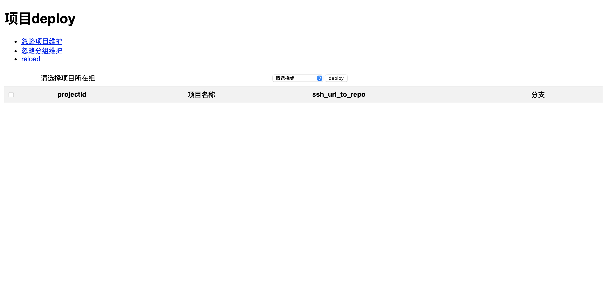
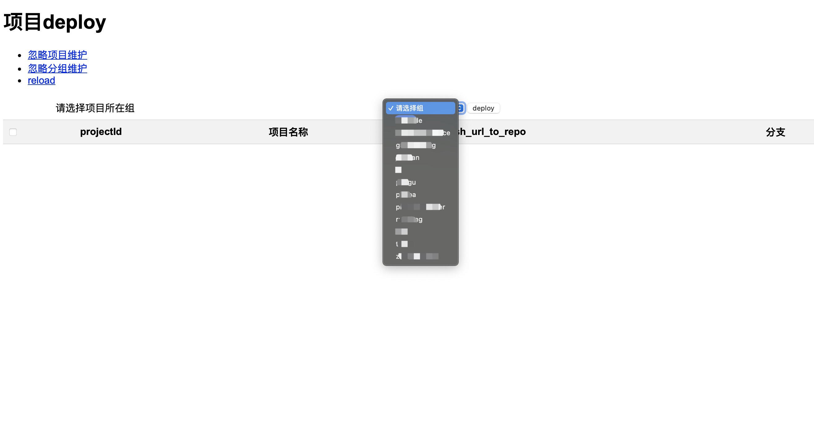
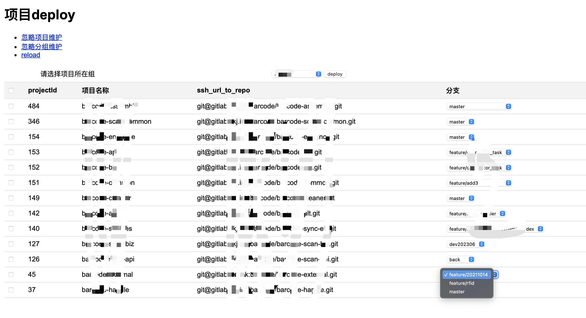

项目介绍
-----------------------------------

用于访问自己的git代码管理服务器，并选中api项目deploy到自己的maven私服中

项目部分截图

使用方法
-----------------------------------
* 1.安装本项目所需要的依赖；
* 2.初始化db/gitlab_project.db中t_gitlab_config表的数据，可以在dbm.py文件中执行save_config(url,token)方法，或是用sqlite3工具打开保存url和token到t_gitlab_config表；
* 3.启用项目 python3 app.py ;
* 4.项目启动时会去查询git服务中所有的分组以及项目并加载到内存中（如果t_gitlab_config中配置的url和token不正确，则无法启动）；
* 5.打开首页http://ip:9001 打开首页，"忽略项目维护"用于维护不需要deploy的项目并且不需要展示列表中的项目，"忽略分组维护"用于维护不需要在下拉框中展示的分组，维护好以后需要在首页点 reload ，重新加载分组和项目到内存中；
* 6.批量deploy操作，打开首页，下拉框选择需要deploy项目所在的分组，可在当前分组选择多个项目后，并选择对应的代码分支，点击deploy按钮发布项目到maven私服中。

**注意**
+ 执行deploy只能在控制台看日志输出来判断执行是否成功，页面无法查看项目是否deploy成功